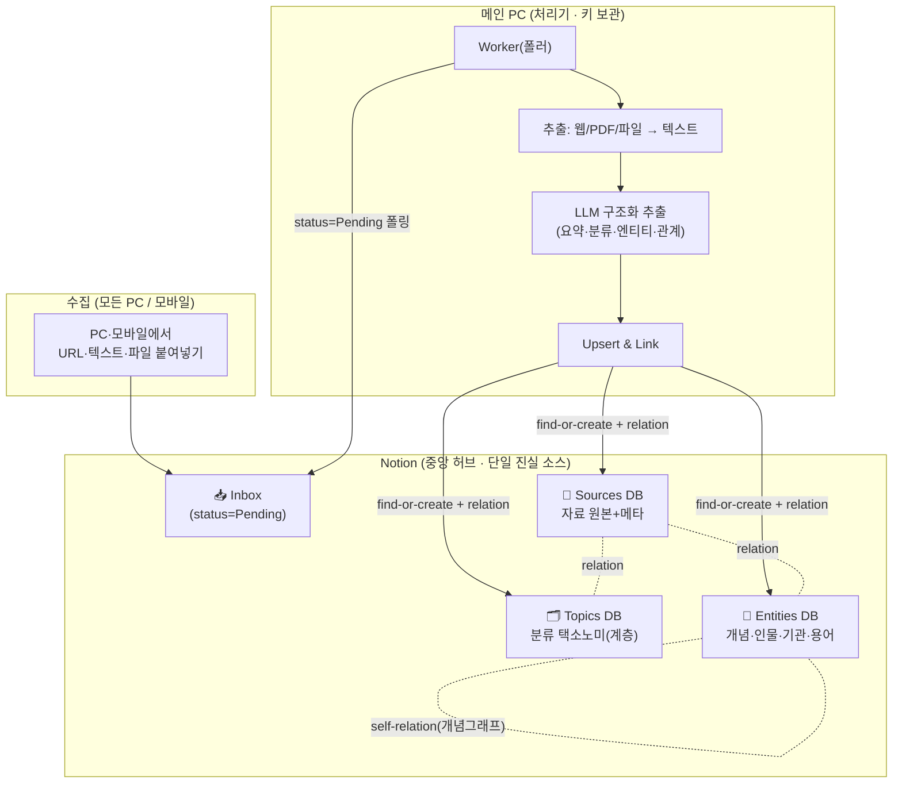
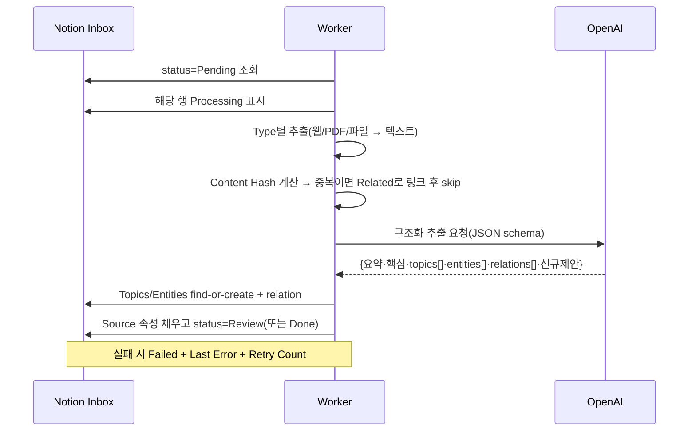

# 지식 파이프라인 설계 — Notion 중앙 허브 지식DB

> 붙여넣은 자료(기사 원문 · 논문 · 웹페이지 · 파일)를 자동 수집·분류하고,
> Notion 관계형 DB를 지식DB(경량 온톨로지)로 구축·활용하는 파이프라인.

## 0. 확정된 설계 방향

| 축 | 결정 | 근거 |
|---|---|---|
| **입력/트리거** | Notion을 중앙 허브(SSOT)로. 여러 PC가 `Inbox`에 수집, **메인 PC 1대**가 처리 | 서버 없이 어디서든 수집·조회. Inbox+Worker 패턴 |
| **지식 구조** | **Notion 관계형 DB만** (relation을 그래프로). Neo4j·벡터DB 없음 | 노션 안에서 완결, 운영 부담 0 |
| **활용 목적** | 주제별 정리·브라우징 · 글쓰기/리서치 보조 · 개념 연결/인사이트 | RAG 챗봇은 후순위(Phase 4 옵션) |

**멀티워커 leasing은 v1에서 제외.** 단일 메인 PC 워커가 Inbox를 순서대로 비우는 방식으로 시작하고,
스키마에 `Worker ID` / `Lease Until` 컬럼만 남겨 나중에 무중단 확장한다.

---

## 1. 전체 아키텍처

**동작 요약**: 어느 기기에서든 `Inbox`에 붙여넣으면 `Pending`으로 쌓인다 → 메인 PC 워커가
켜질 때마다 밀린 항목을 순서대로 처리 → 텍스트 추출 → LLM이 요약·분류·엔티티/관계를 뽑아
`Sources`를 채우고 `Topics`·`Entities`에 관계로 연결 → 사람이 노션에서 `Review`→`Done` 확인.

---

## 2. Notion DB 스키마

3개의 연결된 데이터베이스 = 경량 온톨로지. (Inbox는 Sources의 `Pending` 상태로 통합해도 됨)

### 2.1 📄 Sources (자료) — 메인 DB, 항목당 1행

| 속성 | 타입 | 설명 |
|---|---|---|
| `Title` | title | 제목(없으면 LLM 생성) |
| `Type` | select | article / paper / webpage / file / note |
| `URL` | url | 원본 링크 |
| `Authors` | text | 저자/발행처 |
| `Published` | date | 원문 발행일 |
| `Captured` | date | 수집일(자동) |
| `Status` | select | **Pending → Processing → Review → Done / Failed** |
| `Summary` | text | TL;DR 3~5줄 |
| `Key Points` | text | 핵심 bullet |
| `Raw / File` | files/text | 원문 텍스트 또는 첨부 |
| `Topics` | relation → Topics | 분류(다중) |
| `Entities` | relation → Entities | 등장 개념/인물(다중) |
| `Related Sources` | relation → Sources(self) | 유사·인용 자료 |
| `Content Hash` | text | 중복 방지(멱등성) |
| `Confidence` | number | LLM 분류 신뢰도 |
| `Processing Version` | text | 처리 규칙 버전 |
| `Last Error` | text | 실패 사유 |
| `Worker ID` / `Lease Until` | text/date | (예약) 멀티워커 확장용 |

### 2.2 🗂️ Topics (주제/분류) — 계층 택소노미, 분류의 뼈대

| 속성 | 타입 | 설명 |
|---|---|---|
| `Name` | title | 주제명 |
| `Parent` | relation(self) | 상위 주제(계층) |
| `Definition` | text | 이 주제의 정의/범위 |
| `Aliases` | text | 동의어(엔티티 해소용) |
| `Status` | select | Approved / **Review**(LLM 신규 제안) |
| `Sources` | relation → Sources | 역참조 |

> 씨앗 택소노미는 `configs/knowledge_ontology.json`에서 관리(기존 `sensory_ontology.json`과 동일 패턴).
> LLM이 기존 주제에 못 맞추면 신규를 **`Review` 상태**로만 제안 → 택소노미 폭발 방지, 사람이 승격.

### 2.3 🔗 Entities (개념·인물·기관·용어) — 온톨로지 노드

| 속성 | 타입 | 설명 |
|---|---|---|
| `Name` | title | 정규화된 표기 |
| `Kind` | select | Person / Org / Concept / Method / Place / Work / Term |
| `Aliases` | text | 표기 변형(엔티티 해소) |
| `Description` | text | 한 줄 정의 |
| `Related Entities` | relation(self) | **개념 간 연결 = 온톨로지 그래프** |
| `Sources` | relation → Sources | 등장 자료 |

**여기서 "그래프/온톨로지"가 성립한다**: `Sources↔Topics`(분류), `Sources↔Entities`(추출),
`Entities↔Entities`(개념 연결). Notion 관계 + 그래프 뷰만으로 Neo4j 없이 개념 연결·인사이트를 확보.

---

## 3. 처리 파이프라인 (메인 PC 워커)

**단계 상세**

1. **폴링/획득**: `Status=Pending` 조회 → `Processing`으로 전환(단일 워커라 락 불필요).
2. **추출(Type별)**
   - `webpage/article`: 본문 추출(`trafilatura`/readability) → 노이즈 제거
   - `paper(PDF)`: 텍스트+메타 추출(`pypdf`/`pdfplumber`, 정밀도 필요시 GROBID)
   - `file(docx/pptx/xlsx)`: 텍스트 추출(기존 skill 재사용 가능)
   - `note/text`: 원문 그대로
3. **중복 방지**: `Content Hash`(정규화 텍스트 SHA256). 이미 있으면 새 행 대신 `Related Sources`로 링크.
4. **LLM 구조화 추출**: OpenAI **Structured Outputs**(JSON schema 강제)로 아래를 한 번에 산출
   - `title, type, summary, key_points[]`
   - `topics[]` — **기존 택소노미에 매핑**, 못 맞추면 `suggested_new_topics[]`
   - `entities[{name, kind, aliases}]`
   - `relations[{source_entity, target_entity, relation}]`
   - `confidence`
5. **Upsert & Link**: Topics/Entities를 정규화 이름으로 **find-or-create**(별칭 대조) → relation 연결.
6. **기록**: Source 속성 채우고 `Status=Review`(사람 확인용) → 노션에서 승인 시 `Done`.
7. **오류 처리**: 예외 시 `Failed` + `Last Error` + `Retry Count++`, 다음 실행에 재시도.

---

## 4. 자동 분류 · 온톨로지 운영 규칙

- **씨앗 택소노미로 시작**: 처음부터 완벽할 필요 없이 10~20개 상위 주제만 정의(`configs/knowledge_ontology.json`).
- **신규는 항상 Review로**: LLM이 만든 새 Topic/Entity는 `Review` 상태로만 생성 → 주 1회 사람이 정리(승격/병합/폐기). 택소노미가 난잡해지는 걸 막는 핵심 장치.
- **엔티티 해소(중복 방지)**: 정규화(소문자·공백·구두점 제거) + `Aliases` 대조로 "GPT-4"·"gpt4"·"GPT‑4o"를 한 노드로.
- **버전 관리**: `Processing Version`으로 규칙이 바뀌면 과거 자료 재처리 대상 식별.

---

## 5. 활용 (구축한 지식DB를 쓰는 법)

| 목적 | 구현 |
|---|---|
| **주제별 정리·브라우징** | Notion 뷰: Topics 보드/갤러리, 타임라인, Entity별 필터. 노션 기본 기능만으로 완성 |
| **글쓰기·리서치 보조** | `dossier <topic>` CLI: 해당 주제의 모든 Source를 모아 LLM이 개요·인용·초안 생성 |
| **개념 연결·인사이트** | ① Entities self-relation을 노션 그래프로 시각화 ② **공동출현(co-occurrence) 잡**: 여러 자료에 함께 등장한 엔티티쌍을 주기적으로 `Related Entities`로 자동 제안 → 눈에 안 띄던 연결 발굴 |

> 벡터 검색/RAG 챗봇("내 자료 기준으로 답해줘")은 Phase 4 옵션. 필요해지면 `Sources.Summary` 임베딩만 로컬 캐시로 추가하면 됨(노션 데이터에서 언제든 재생성 가능한 캐시로 취급).

---

## 6. 단계별 로드맵

| Phase | 내용 | 산출물 |
|---|---|---|
| **0. 스키마** | Notion에 3개 DB + 씨앗 택소노미 생성 | Notion DB, `configs/knowledge_ontology.json` |
| **1. 단건 Ingest** | CLI로 URL/텍스트 1건 → 전체 파이프라인 → 노션 기록. 루프 검증 | `src/knowledge/ingest.py` |
| **2. Inbox 폴러** | 메인 PC가 Inbox `Pending`을 배치 처리 | `src/knowledge/worker.py` |
| **3. 활용 도구** | `dossier` 생성기 + 공동출현 인사이트 잡 | `src/knowledge/dossier.py`, `insights.py` |
| **4. (옵션)** | 임베딩 시맨틱 검색 / RAG 챗봇 | 후순위 |

---

## 7. 스택 (기존 repo 재사용)

- **언어/런타임**: Python 3.9+ (기존과 동일)
- **LLM**: `openai` Structured Outputs (기존 `OPENAI_API_KEY`/`OPENAI_MODEL` 재사용)
- **Notion**: `notion-client` (공식 SDK)
- **추출**: `trafilatura`(웹), `pypdf`/`pdfplumber`(PDF), 기존 docx/pptx/xlsx skill
- **설정**: `.env` + `configs/knowledge_ontology.json` (기존 온톨로지 config 패턴)
- **보안**: Notion 토큰·OpenAI 키는 메인 PC에만. `Processing Allowed` 승인된 자료만 LLM 전송, 전송 전 개인정보 마스킹 옵션, 로그에 원문·키 미기록.

---

## 8. 열린 결정 사항

1. **Review 게이트**: 모든 자료를 사람이 `Review`로 한 번 볼지, 신뢰도 높으면 바로 `Done` 자동화할지.
2. **파일 보관**: 원본 파일을 Notion 첨부로 올릴지 / 메타+공유링크만 기록할지(큰 파일).
3. **씨앗 택소노미 도메인**: 주로 어떤 분야 자료인지(예: AI/기술, 인문, 미술 등) — 상위 주제 초안에 반영.
